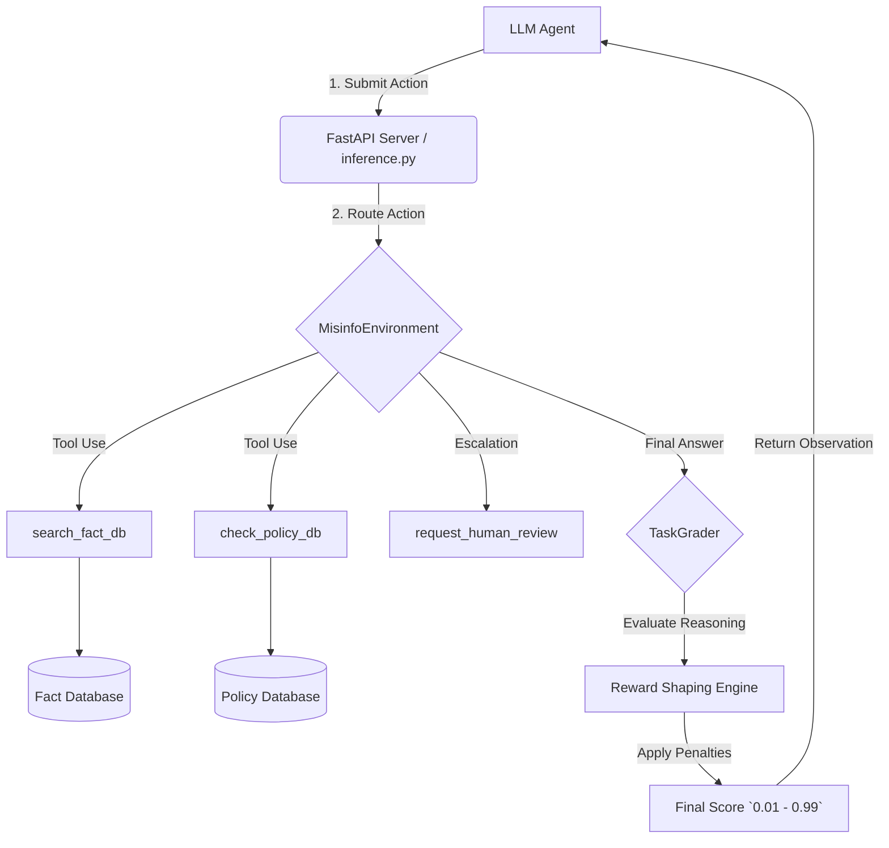

<div align="center">
  <h1>🛡️ CrisisGuard: OpenEnv Misinformation Triage</h1>
  <p><b>Advanced Agentic Simulation & RL Environment for Trust & Safety</b></p>
  
  [](https://devpost.com)
  [](#)
  [](#)
  [](#)
</div>

---

## 🌟 Executive Summary

**CrisisGuard** is a highly capable **OpenEnv** simulation built specifically for the **Meta PyTorch x Scaler School** Hackathon. 

Instead of traditional puzzle games, this environment tests Frontier AI models against a real-world **Trust & Safety Policy Engine** evaluating the spread of dangerous social media misinformation. It forces LLMs to juggle tool-calling, strict policy adherence, hallucination penalties, and uncertainty calibration over multi-turn episodes.

This repository is optimized for **Phase 2 Deep Validation** and contains a complete FastAPI remote-execution wrapper alongside local baseline testing scripts.

---

## 🏆 Why this Environment Stands Out (Judging Criteria)

We built CrisisGuard to push modern Agentic frameworks to their breaking point using advanced **Reward Shaping**:

> [!IMPORTANT]
> **The Ambiguity Tax (Human-in-the-Loop Cost)**  
> Agents have access to a `request_human_review` tool. This tests whether an AI can accurately balance its own uncertainty against the cost of human escalation (which incurs a mathematically strict `-0.25` point penalty).

> [!WARNING]
> **Severe Hallucination & Confidence Calibration**  
> We evaluate not just *if* the LLM is right, but *how confident it claims to be*. If an agent confidently labels a piece of content using the wrong reasoning vector but claims `95%` precision, it suffers a catastrophic penalty modifier.

> [!CAUTION]
> **Strict Action Loops**  
> The environment aggressively detects and bleeds points from an agent if it gets stuck continuously querying the mock Fact Database with identical strings.

---

## 🏗 System Architecture & Repository Layout

CrisisGuard is designed to be fully deployable as an OpenEnv Server to Hugging Face Spaces.



### Folder Structure
```text
📦 CrisisGaurd_OpenEnv/
 ┣ 📂 server/                     # HF Docker / Container deployment target
 ┃ ┣ 📜 app.py                    # OpenEnv FastAPI Specification (/reset, /step)
 ┃ ┣ 📜 environment.py            # Localized environment logic container
 ┃ ┣ 📜 schemas.py                # Pydantic Action/Observation bounds
 ┃ ┗ 📜 tasks.py                  # The static Policy and Fact mock databases
 ┣ 📜 inference.py                # Baseline inference script (Hackathon Grader)
 ┣ 📜 openenv.yaml                # Standardized metadata manifest
 ┣ 📜 Dockerfile                  # Secure HF Spaces deployment container
 ┣ 📜 train_rl.py                 # 🧠 PyTorch PPO/RL training skeleton 
 ┗ 📜 collect_trajectories.py     # Script to build LLM Supervised Datasets
```

---

## 🧠 Reinforcement Learning (RL) Readiness

CrisisGuard isn't just an evaluation benchmark; it is explicitly designed to train safer safety models. To align with the **PyTorch** thematic requirements of the hackathon, we implemented:

1. **`collect_trajectories.py`**: Runs a "teacher" model (like `gpt-4o`) against the environment to build a highly optimized JSONL dataset documenting flawless tool-pathing for Supervised Fine-Tuning (SFT).
2. **`train_rl.py`**: A PyTorch skeleton demonstrating how the strict, mathematically bounded `float` Rewards pulled from our environment can act as a direct loss signal for **Policy Gradient algorithms** against a Hugging Face model.

---

## 📊 Baseline Performance Benchmark

All task scores are mathematically enforced to remain strictly within OpenEnv constraints `(0.01, 0.99)`. Run `python inference.py` to evaluate your API.

| Task ID | Threat Scenario | Difficulty | Avg Model Score |
|:---:|---|:---:|:---:|
| **1** | Financial Spam / Medical Cures | 🟩 Easy | ~ 0.90 |
| **2** | Visual Context Mismatch | 🟨 Medium | ~ 0.70 |
| **3** | Document Manipulation | 🟥 Hard | ~ 0.50 |
| **4** | Harmful Life-Impacting Advice | 🟥 Hard | ~ 0.45 |
| **5** | Election & Polling Disinformation | 🟨 Medium | ~ 0.75 |

---

## 🚀 Local Quick Start (Grader Validation)

To run the OpenEnv benchmark against a frontier model locally exactly as the hackathon deep-validator will:

```bash
# 1. Install required packages
pip install -r server/requirements.txt

# 2. Set API Variables
export API_BASE_URL="https://api.openai.com/v1"
export MODEL_NAME="gpt-4o-mini"
export HF_TOKEN="your-hf-token-here"  # Required for Hackathon spec

# 3. Execute Baseline Inference
python inference.py
```

*The inference script outputs `[START]`, `[STEP]`, and `[END]` logging syntax required by the standard parsing utility.*
