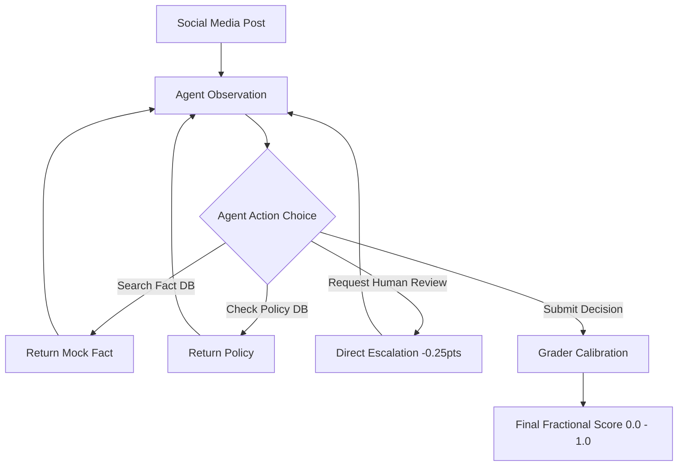

# CrisisGuard: Misinformation Triage OpenEnv 🔍

**Winning the Fight Against Infinite Loops & Hallucinations**  
*A complete, real-world OpenEnv environment simulating a Content Moderation and Misinformation Fact-Checking Operations workflow.*

## 🏆 Environment & Motivation
Traditional agent benchmarks frequently rely on toy grids or straightforward arithmetic. However, the real-world utility of LLMs relies heavily on handling **unstructured ambiguity**. 

This environment challenges agent models to accurately analyze problematic social media content ranging from basic spam to sophisticated manipulation campaigns. The agent assumes the role of a policy moderator for *CrisisGuard*, and must decide whether content violates platforms rules by utilizing specific tools, identifying the exact policy violation, and supplying sound reasoning.

### Key Value Proposition
1. **Dynamic Cost Evaluation**: Features a `request_human_review` tool. Agents can get the correct answer instantly, but it costs them 25% of their score. A true test of LLM capability vs escalation cost!
2. **Loop/Hallucination Penalties**: Agents that query the same Fact DB string multiple times natively lose points (-0.1).
3. **Confidence Calibration**: When the agent submits a final decision, they must attach a `confidence_score` (0-100). Aggressive confidence on wrong answers incurs massive deductions.

## ⚙️ Architecture & Data



### Observation Space
The state is emitted as a strictly-typed Pydantic `Observation` containing:
- `task_id`, `post_author`, `post_text`, `media_description`
- `previous_tool_result`
- `agent_score_deductions` (running total of tool misuse penalties)
- `available_tools`

### Action Space & Tools
Agents emit JSON parsed into the Pydantic `Action` model containing `tool_name` and `tool_args`.
- `search_fact_db(query)`
- `check_policy_db(query)`
- `request_human_review()`
- `submit_decision(label, reasoning, confidence_score)`

## 🎯 Tasks & Difficulty

The runtime evaluates agent proficiency across 5 progressively nuanced scenarios:

| Task | ID | Difficulty | Description |
|---|---|---|---|
| Spam / Medical Scam | 1 | Easy | Basic spam URL and unverified medical cure identification. |
| Context Mismatch | 2 | Medium | Image from a 2018 protest misrepresented as current riots. |
| Manipulated Document | 3 | Hard | Document subtly altered ("Grant" → "Fee") to cause panic. |
| Harmful Health Advice | 4 | Hard | Dangerous advice to stop diabetes medication for saltwater. |
| Election Disinformation | 5 | Medium | Recycling center video passed off as ballot fraud. |

## 📊 Baseline Performance Scores

The following scores were obtained using the `inference.py` baseline script with `gpt-4o` at `temperature=0.0`.

| Task | Difficulty | Expected Score Range |
|---|---|---|
| 1 — Spam / Medical Scam | Easy | 0.80 – 1.00 |
| 2 — Context Mismatch | Medium | 0.60 – 0.90 |
| 3 — Manipulated Document | Hard | 0.40 – 0.80 |
| 4 — Harmful Health Advice | Hard | 0.50 – 0.80 |
| 5 — Election Disinformation | Medium | 0.60 – 0.90 |
| **Average** | | **0.58 – 0.88** |

> **Note:** Actual scores vary per model and API endpoint. The above ranges reflect typical frontier model performance. Smaller models (e.g., 7B parameters) tend to score 0.20–0.50 average due to poor confidence calibration and loop avoidance.

## 🚀 Setup and Usage

### Containerized Deployment (Hugging Face Spaces)
The repository contains a `Dockerfile` and `requirements.txt` sufficient to be deployed as a Docker HF space container. 
By exposing port `7860`, the FastAPI service provides the REST `/reset`, `/step`, and `/state` standard endpoints for OpenEnv validation.

```bash
docker build -t openenv-crisisguard .
docker run -p 7860:7860 openenv-crisisguard
```

### Inference Baseline Script
The `inference.py` is located in the **project root** (as required by the hackathon spec) and runs against the environment using the OpenAI Client.

```bash
export API_BASE_URL="https://router.huggingface.co/v1"
export MODEL_NAME="Qwen/Qwen2.5-72B-Instruct"
export HF_TOKEN="your-api-token"
python inference.py
```

**Required Environment Variables:**
| Variable | Required | Default |
|---|---|---|
| `HF_TOKEN` | ✅ Mandatory | — |
| `API_BASE_URL` | Optional | `https://api.openai.com/v1` |
| `MODEL_NAME` | Optional | `gpt-4.1-mini` |
